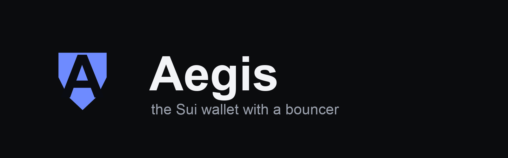

<p align="center">
  
</p>

<p align="center">
  <b>The Sui wallet with a bouncer — an AI reads every transaction and blocks drainers before you sign.</b>
</p>

<p align="center">
  <a href="https://aegis-wallet.vercel.app"><b>Live demo</b></a>
  &nbsp;·&nbsp; <a href="https://github.com/preyam2002/aegis-wallet">Repo</a>
  &nbsp;·&nbsp; Demo video — <i>coming soon</i>
  &nbsp;·&nbsp; Sui Overflow 2026 · <b>DeFi &amp; Payments</b>
</p>

---

Sui has no Blockaid, no ScamSniffer, no transaction firewall — one malicious PTB, signed once, can sweep a wallet. Aegis closes that gap on three layers:

- **A real Sui Wallet Standard browser extension** that intercepts every dApp transaction, simulates it, and runs an **AI risk judge (Claude)** that explains in plain English what it does — then blocks drainers, sweeps, untrusted packages, and address poisoning before you sign. A deterministic rule floor hard-blocks catastrophic outflows, so a wrong or jailbroken model can never wave a drain through.
- **A live decision dashboard** that streams every block and approval in real time.
- **Vault Mode** — opt-in 2-of-2 multisig whose second signer is an AWS Nitro TEE enclave that refuses to co-sign drains, enforced on-chain.

The pitch is safety, not feature count. **Sui Overflow 2026 — DeFi & Payments.**

## The three things Aegis does that Slush doesn't

1. **Pre-sign simulation, in plain English.** Before you sign, Aegis runs `client.core.simulateTransaction` and renders exactly what the transaction does — *you send X, you receive Y, these objects leave your wallet* — with any net outflow shown in red. No raw hex, no guessing.
2. **A risk scanner for the patterns that drain wallets.** Deterministic, local heuristics over the simulated effects flag: an unknown recipient, a coin or whole-object sweep, a brand-new or unverified package, a never-interacted package, and hits against a curated drainer denylist. Each finding carries a human reason and a severity the signing screen gates on.
3. **Address-poisoning protection.** A look-alike recipient that shares the first/last characters of a saved contact triggers a blocking side-by-side comparison, and zero-value dust inbound transfers are hidden from activity by default.

These are the surfaces a judge can watch *block a live drain*: feed a denylisted recipient, a wallet sweep, an unverified package, or a poisoned look-alike, and the signing screen refuses to go green. The deterministic backbone of that demo is committed in `app/src/lib/safe-wallet-demo.test.ts`.

## Vault Mode (opt-in testnet proof)

Vault Mode is a **2-of-2 native multisig** where the second signer is a Nautilus TEE enclave that independently simulates each transaction and only co-signs if it passes published policy. A phished user signature alone is 1-of-2 and the network rejects it; the enclave refuses drains and can emit an on-chain `PolicyPassed` / `PolicyRejected` receipt.

**Honest trust framing:** Vault Mode is *drain-resistant under the AWS-Nitro + reproducible-build trust model* — **not** "provably un-drainable." It is a hardware-TEE plus reproducible-build model, not ZK. Nautilus is an official Mysten template, not an audited product. Current evidence is testnet only: a non-debug AWS Nitro enclave is registered on-chain and the registered public key matches the live `nitro-attested` co-signer. Mainnet and production availability are not claimed.

Current testnet Vault proof:

| Artifact | ID / digest |
| --- | --- |
| EnclaveConfig | `0xb5f8cc7c85c21485ef75affcec55f093650e320c63e2d5d36000dc80bbd03281` |
| Registered enclave | `0xb87f92d67204ec753439a46080180a0ea7cb0b1b356ddc634149821aefc951a4` |
| Live enclave public key | `db26feb8f8ac6e91980718534d87358dfa857765435cbccb9dda89f4ff40e2c3` |
| Attested 2-of-2 benign tx | `Rkm8NFgPw6MLm9ZUzySb6syBbkN9b4zcy4wDXrxvyVd` |
| Fresh `PolicyRejected` receipt | `CoGtcaVzqxAsev4nJJr9Fzqs6TFxBVf8Cw8hLD9GaCC` |

## Structure

| Path | Purpose |
| --- | --- |
| `app/` | Next.js web wallet shell, deterministic transaction analyzer, and safety UI |
| `extension/` | Browser-extension MV3 manifest and origin-scoped dApp bridge |
| `enclave/` | Rust Nautilus policy co-signer service (`/health_check`, `/get_attestation`, `/co_sign`) |
| `mobile/` | Mobile wallet shell model and Expo-style native app bundle generator |
| `move/` | `aegis` policy/recovery/subaccount/attestation packages and the vendored Nautilus `enclave` module |
| `sponsor/` | Enoki private-key sponsorship control plane for zero-gas onboarding |
| `packages/shared/` | `simulateTransaction` → `SimSummary` mapping and chain adapters shared by app and enclave |

## Commands

```bash
pnpm install --ignore-scripts
pnpm test                              # full workspace unit suite
pnpm typecheck
pnpm lint
pnpm --filter @aegis/app test src/lib/safe-wallet-demo.test.ts   # the "blocks a drainer" demo backbone
pnpm --filter @aegis/app dev
pnpm preflight:external-gates          # diagnostic: checks Nitro attestation artifacts, Enoki, staking, and mainnet gates; browser/native is optional proof
pnpm test:integration:simulate         # maps a real testnet PTB into SimSummary
pnpm test:integration:wallet-snapshot  # live testnet portfolio/activity/DeFi snapshot
pnpm test:integration:swap-quote       # mainnet read-only, zero-wallet-fee swap route
pnpm test:integration:localnet-stake   # native staking PTB on a disposable localnet

cd enclave
CARGO_HOME=/private/tmp/aegis-cargo cargo test

cd ../move/aegis
MOVE_HOME=/private/tmp/aegis-move-home sui move test
```

## Fast local demo

```bash
pnpm --filter @aegis/app dev
```

Open `http://localhost:3030`. The wallet has two tabs in the left rail:

- **Wallet** — leads with the safety demo (**See it block a drain** runs read-only drainer, wallet-sweep,
  untrusted-package, and poisoned-address previews with no funds at risk), then live portfolio / receive
  (real QR + testnet faucet) / activity. The send and stake flows do the live nutrition-label path: build
  PTB, dry-run, show net change, gas, objects leaving, findings, then sign only if the risk is not critical.
- **Security** — account settings (backup status + key export) and the testnet-attested Vault Mode proof,
  grouped as on-chain evidence rather than mixed into the daily-driver surface.

First-run wallet hygiene is explicit: created accounts must back up the `suiprivkey...` before the
dashboard opens, and unlocked accounts can export the secret key from the Security tab after entering the
wallet password. This is testnet-only hot-key custody, not a mainnet hardware-wallet claim.

## Trust Model

Vault Mode should be described narrowly: it blocks configured drain classes when the transaction requires both the user signature and a reachable enclave co-signature, and when the enclave PCR / public key is registered and verified on-chain. This is a TEE plus reproducible-build trust model, not ZK and not unconditional un-drainability. The Safe Wallet layer (simulation, risk scanner, address-poisoning) needs no enclave and is the shipping core; Vault Mode is opt-in and currently proven on testnet with a non-debug AWS Nitro enclave.
